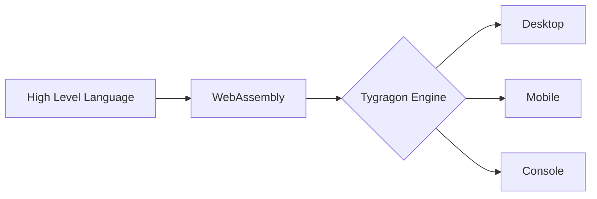

# Tygragon
A project building cross platform universal programs using web

## Overview
Tygragon is an engine that can distribute any type of programs to any platforms in one code

## Tygragon's objective
* Suitable for next-generation programming education with low entry barriers and high achievement.
* Easy to maintain by managing with a single code.
